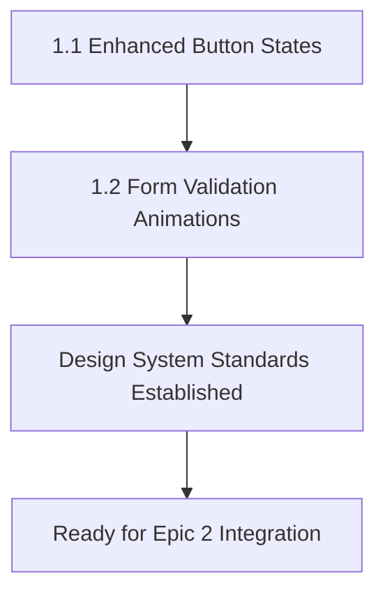
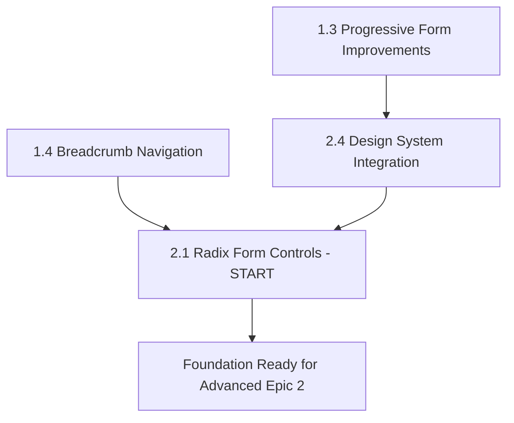
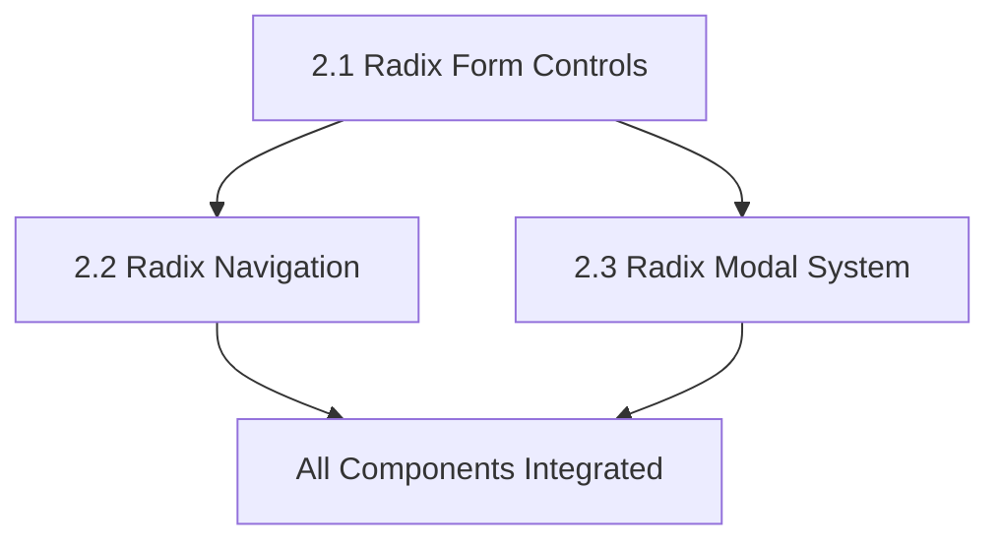

# Epic Dependencies Map: SCISS Platform Modernization

## Overview

This document maps the dependencies and integration points between **Epic 1 (Design & UX Enhancement)** and **Epic 2 (Component Architecture Refactoring with Radix UI)** to ensure optimal implementation sequencing and technical coordination.

## Epic Summary

### Epic 1: Design & UX Enhancement (Foundation)

**Goal:** Establish modern interaction patterns and design system consistency

- **1.1** Enhanced Button Interaction States
- **1.2** Form Validation Micro-Animations
- **1.3** Progressive Form Improvements
- **1.4** Breadcrumb Navigation Component

### Epic 2: Component Architecture Refactoring (Enhancement)

**Goal:** Modernize components with Radix UI while preserving design excellence

- **2.1** Form Controls Migration to Radix UI
- **2.2** Navigation Components with Radix UI
- **2.3** Modal and Dialog System with Radix UI
- **2.4** Design System Token Integration

---

## 🔗 CRITICAL DEPENDENCIES MATRIX

### **Story-Level Dependencies**

| Epic 2 Story                      | Depends On Epic 1                           | Dependency Type | Integration Points                                        |
| --------------------------------- | ------------------------------------------- | --------------- | --------------------------------------------------------- |
| **2.1 Radix Form Controls**       | **1.1 Button States + 1.2 Form Animations** | **CRITICAL**    | Animation timing, interaction states, validation feedback |
| **2.2 Radix Navigation**          | **1.1 Button States + 1.4 Breadcrumbs**     | **HIGH**        | Navigation interaction patterns, focus states             |
| **2.3 Radix Modal System**        | **1.1 Button States + 1.2 Form Animations** | **MEDIUM**      | Modal button interactions, form integration               |
| **2.4 Design System Integration** | **ALL Epic 1 Stories**                      | **FOUNDATION**  | CSS tokens, animation standards, interaction patterns     |

### **Technical Integration Points**

#### **🎨 Animation & Interaction Standards**

**Epic 1 Establishes → Epic 2 Applies**

```javascript
// Epic 1.1 establishes timing standards
const ANIMATION_TIMING = 'cubic-bezier(0.4, 0, 0.2, 1)';
const INTERACTION_DURATION = '0.2s';

// Epic 2.1-2.4 apply to Radix components
.radix-select-trigger {
  transition: all 0.2s cubic-bezier(0.4, 0, 0.2, 1);
}
```

**Dependencies:**

- **2.1** Must use Epic 1.1 button interaction timing for Radix triggers
- **2.2** Must apply Epic 1.1 focus indicators to Radix navigation
- **2.3** Must integrate Epic 1.1 button states in modal actions
- **2.4** Must systematize Epic 1.1 animation standards across all Radix components

#### **📝 Form Enhancement Pipeline**

**Epic 1 Foundation → Epic 2 Enhancement**

```javascript
// Epic 1.2 establishes validation animation patterns
const ValidationAnimation = {
  error: "shake 0.3s ease-in-out",
  success: "subtle positive feedback",
  timing: "cubic-bezier(0.4, 0, 0.2, 1)",
};

// Epic 2.1 integrates with Radix form controls
const RadixFormControl = {
  validation: ValidationAnimation,
  accessibility: "Enhanced ARIA support",
  functionality: "Search, grouping, keyboard navigation",
};
```

**Dependencies:**

- **2.1** MUST integrate Epic 1.2 validation animations with Radix state management
- **2.1** MUST apply Epic 1.3 auto-save functionality to enhanced Radix forms
- **2.3** MUST coordinate Epic 1.3 help modals with Radix Dialog system

#### **🧭 Navigation Enhancement Chain**

**Epic 1 Patterns → Epic 2 Implementation**

```javascript
// Epic 1.4 establishes breadcrumb navigation patterns
const NavigationPatterns = {
  breadcrumbs: "Route-based generation with ARIA landmarks",
  activeStates: "Consistent with main navigation",
  mobileOptimization: "Responsive design patterns",
};

// Epic 2.2 enhances with Radix NavigationMenu
const RadixNavigation = {
  enhanced: NavigationPatterns,
  accessibility: "Superior keyboard navigation",
  mobile: "Better touch interactions",
};
```

**Dependencies:**

- **2.2** MUST coordinate with Epic 1.4 breadcrumb implementation
- **2.2** MUST apply Epic 1.1 interaction states to Radix navigation elements
- **2.4** MUST ensure breadcrumb design tokens align with Radix navigation styling

---

## 📅 OPTIMAL IMPLEMENTATION SEQUENCE

### **Phase 1: Foundation (Weeks 1-2)**

**PRIORITY: Epic 1 Stories - Establish Standards**



**Week 1:** Story 1.1 Enhanced Button Interaction States

- Establishes animation timing: `cubic-bezier(0.4, 0, 0.2, 1)`
- Creates focus indicator standards: `--accent-yellow` outline
- Sets interaction feedback patterns: hover, active, disabled states

**Week 2:** Story 1.2 Form Validation Micro-Animations

- Builds on 1.1 animation standards
- Creates validation feedback system: shake animations, success states
- Establishes form interaction patterns for Epic 2.1 integration

### **Phase 2: Progressive Enhancement (Weeks 3-4)**

**PRIORITY: Epic 1 Advanced + Epic 2 Foundation**



**Week 3:** Stories 1.3 + 2.4 (Parallel Development)

- **1.3** Progressive Form Improvements: Auto-save, progress indication
- **2.4** Design System Token Integration: Radix CSS architecture setup

**Week 4:** Stories 1.4 + 2.1 (Coordinated Development)

- **1.4** Breadcrumb Navigation: Site navigation enhancement
- **2.1** Radix Form Controls: **DEPENDS ON** 1.1, 1.2, 2.4 completion

### **Phase 3: Radix Integration (Weeks 5-6)**

**PRIORITY: Epic 2 Advanced Implementation**



**Week 5:** Story 2.2 Radix Navigation Components

- **DEPENDS ON:** 1.1 (button states), 1.4 (breadcrumbs), 2.4 (design tokens)
- Integrates Epic 1 interaction patterns with Radix NavigationMenu

**Week 6:** Story 2.3 Radix Modal Dialog System

- **DEPENDS ON:** 1.1 (button states), 1.2 (form animations), 2.4 (design tokens)
- Completes comprehensive component modernization

---

## ⚠️ CRITICAL INTEGRATION POINTS

### **🚨 Blocking Dependencies**

#### **Epic 2.1 (Radix Form Controls) CANNOT START until:**

- ✅ **1.1** Enhanced Button States (animation timing standards)
- ✅ **1.2** Form Validation Animations (validation feedback patterns)
- ✅ **2.4** Design System Token Integration (CSS architecture for Radix)

#### **Epic 2.2 (Radix Navigation) CANNOT START until:**

- ✅ **1.1** Enhanced Button States (navigation interaction patterns)
- ✅ **1.4** Breadcrumb Navigation (navigation coordination)
- ✅ **2.4** Design System Token Integration (navigation CSS tokens)

#### **Epic 2.3 (Radix Modal System) CANNOT START until:**

- ✅ **1.1** Enhanced Button States (modal button interactions)
- ✅ **2.4** Design System Token Integration (modal CSS architecture)

### **🔄 Shared Implementation Assets**

#### **CSS Animation Standards (Established in 1.1, Used in 2.1-2.3)**

```css
/* Epic 1.1 establishes, Epic 2.1-2.3 implement */
:root {
  --animation-timing: cubic-bezier(0.4, 0, 0.2, 1);
  --interaction-duration: 0.2s;
  --transform-duration: 0.3s;
}
```

#### **Focus Management Patterns (Epic 1.1 → Epic 2.2, 2.3)**

```css
/* Consistent focus indicators across all components */
.focus-indicator {
  outline: 2px solid var(--accent-yellow);
  outline-offset: 2px;
}
```

#### **Form Integration Pipeline (Epic 1.2, 1.3 → Epic 2.1)**

```javascript
// Enhanced form state management
const useEnhancedForm = () => {
  // Epic 1.2 validation animations
  // Epic 1.3 auto-save functionality
  // Epic 2.1 Radix component integration
};
```

---

## 🎯 COORDINATION STRATEGIES

### **Development Team Coordination**

#### **Parallel Development Opportunities**

- **Week 3:** Epic 1.3 + Epic 2.4 can develop simultaneously
- **Week 4:** Epic 1.4 + Epic 2.1 can coordinate development
- **Week 5-6:** Epic 2.2 + Epic 2.3 can develop in parallel

#### **Cross-Story Testing Requirements**

```javascript
// Integration testing scenarios
describe("Epic Integration Tests", () => {
  test("Radix forms use Epic 1 animation standards", () => {
    // Verify 2.1 implements 1.1 + 1.2 patterns
  });

  test("Navigation coordination works correctly", () => {
    // Verify 2.2 integrates with 1.4 breadcrumbs
  });

  test("Modal system uses consistent interactions", () => {
    // Verify 2.3 implements 1.1 button standards
  });
});
```

### **Quality Assurance Checkpoints**

#### **After Epic 1 Completion:**

- [ ] Animation timing standards documented and implemented
- [ ] Form validation patterns tested and working
- [ ] Progressive form features functioning correctly
- [ ] Breadcrumb navigation integrated with main navigation

#### **After Epic 2.4 Completion:**

- [ ] Design system tokens properly mapped to Radix components
- [ ] CSS architecture supports all planned Radix integrations
- [ ] Performance benchmarks established for component migration

#### **After Epic 2 Completion:**

- [ ] All Radix components use Epic 1 interaction standards
- [ ] Form controls integrate seamlessly with Epic 1 enhancements
- [ ] Navigation system coordinates Epic 1.4 + Epic 2.2 features
- [ ] Modal system supports form and navigation integration

---

## 📊 SUCCESS METRICS

### **Integration Success Indicators**

- **Design Consistency:** 100% visual consistency between Epic 1 and Epic 2 implementations
- **Animation Coordination:** All components use identical timing functions and patterns
- **Accessibility Excellence:** WCAG 2.1 AA compliance maintained across both epics
- **Performance Standards:** 60fps animations maintained in all component interactions

### **Developer Experience Metrics**

- **Implementation Efficiency:** Reduced development time due to clear dependencies
- **Code Reuse:** Maximum reuse of Epic 1 patterns in Epic 2 implementation
- **Testing Coverage:** Comprehensive integration testing between epic features
- **Documentation Quality:** Clear coordination guidance for future development

---

## 🎉 INTEGRATION COMPLETION CHECKLIST

### **Epic 1 → Epic 2 Handoff Requirements**

- [ ] All Epic 1 animation standards documented in design system
- [ ] Form validation patterns tested and ready for Radix integration
- [ ] Navigation patterns established and coordination points identified
- [ ] CSS custom properties validated for Radix component usage

### **Epic 2 Integration Validation**

- [ ] Radix form controls implement Epic 1.1 + 1.2 patterns correctly
- [ ] Radix navigation coordinates with Epic 1.4 breadcrumb system
- [ ] Modal system integrates Epic 1 button and form enhancements
- [ ] Design system maintains consistency across all components

### **Final Integration Testing**

- [ ] Cross-epic user journeys tested (navigation → forms → modals)
- [ ] Performance benchmarks validated for complete system
- [ ] Accessibility compliance verified across all integrated features
- [ ] Mobile experience optimized for all Epic 1 + Epic 2 features

---

**Document Version:** 1.0  
**Created:** 2024-12-19  
**Author:** Scrum Master Bob  
**Status:** Complete - Ready for Development Handoff
