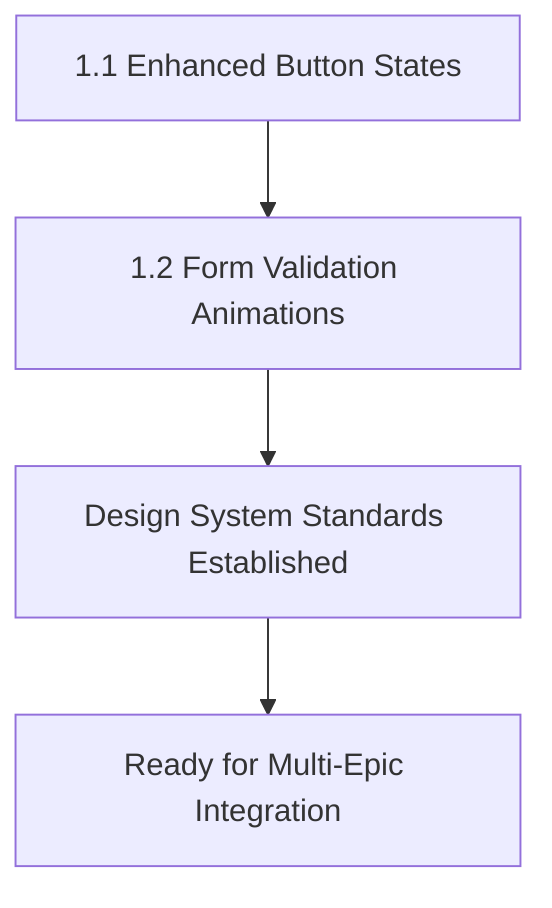
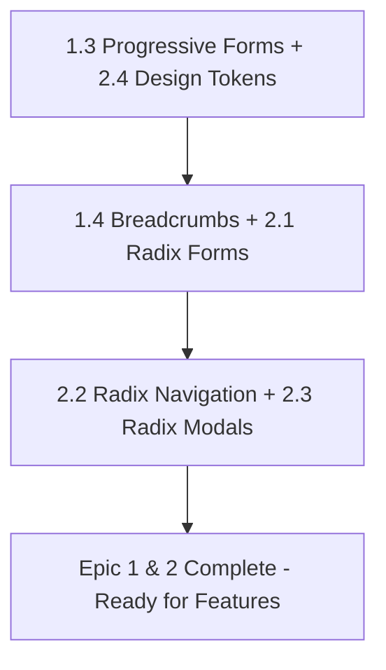
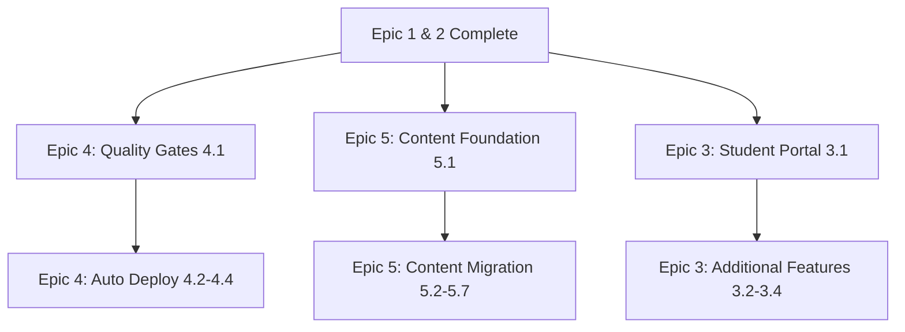

# Epic Dependencies Map: SCISS Platform Modernization

## Overview

This document maps the dependencies and integration points between all five epics in the SCISS platform modernization initiative to ensure optimal implementation sequencing and technical coordination.

## Epic Summary

### Epic 1: Design & UX Enhancement (Foundation)

**Goal:** Establish modern interaction patterns and design system consistency

- **1.1** Enhanced Button Interaction States
- **1.2** Form Validation Micro-Animations
- **1.3** Progressive Form Improvements
- **1.4** Breadcrumb Navigation Component

### Epic 2: Component Architecture Refactoring (Enhancement)

**Goal:** Modernize components with Radix UI while preserving design excellence

- **2.1** Form Controls Migration to Radix UI
- **2.2** Navigation Components with Radix UI
- **2.3** Modal and Dialog System with Radix UI
- **2.4** Design System Token Integration

### Epic 3: New Feature Development (Educational Platform Enhancement)

**Goal:** Develop comprehensive educational features for post-enrollment student experience

- **3.1** Student Portal & Dashboard System

### Epic 4: CI/CD & DevOps Enhancement (Automation)

**Goal:** Enhance CI/CD pipeline with quality gates, automatic deployment, and monitoring

- **4.1** Quality Gates & Epic Integration Testing
- **4.2** Automatic Production Deployment Pipeline
- **4.3** Enhanced Environment Management & Preview Deploys
- **4.4** Post-Deployment Monitoring & Health Checks

### Epic 5: Content Architecture Modernization (Blog Post System)

**Goal:** Transform content structure to individual pages with JSON-based architecture for better SEO

- **5.1** Content Infrastructure Foundation
- **5.2** Course Content Migration and Dynamic Pages
- **5.3** Activity Content Migration and Dynamic Pages
- **5.4** Trip Content Migration and Dynamic Pages
- **5.5** Staff and Lecturer Profile System
- **5.6** Content Listing and Navigation Enhancement
- **5.7** SEO Optimization and Content Discovery

---

## 🔗 CRITICAL DEPENDENCIES MATRIX

### **Cross-Epic Dependencies Matrix**

| Epic/Story                        | Depends On                                  | Dependency Type | Integration Points                                        |
| --------------------------------- | ------------------------------------------- | --------------- | --------------------------------------------------------- |
| **2.1 Radix Form Controls**       | **1.1 Button States + 1.2 Form Animations** | **CRITICAL**    | Animation timing, interaction states, validation feedback |
| **2.2 Radix Navigation**          | **1.1 Button States + 1.4 Breadcrumbs**     | **HIGH**        | Navigation interaction patterns, focus states             |
| **2.3 Radix Modal System**        | **1.1 Button States + 1.2 Form Animations** | **MEDIUM**      | Modal button interactions, form integration               |
| **2.4 Design System Integration** | **ALL Epic 1 Stories**                      | **FOUNDATION**  | CSS tokens, animation standards, interaction patterns     |
| **3.1 Student Portal**            | **Epic 1 + Epic 2**                         | **HIGH**        | Enhanced interactions, Radix components for portal UI     |
| **4.1 Quality Gates**             | **Epic 1 + Epic 2**                         | **CRITICAL**    | Component testing, validation automation                  |
| **5.1-5.7 Content System**        | **Epic 1 + Epic 2**                         | **MEDIUM**      | Enhanced navigation, breadcrumbs, design consistency      |

### **Technical Integration Points**

#### **🎨 Animation & Interaction Standards**

**Epic 1 Establishes → Epic 2 Applies**

```javascript
// Epic 1.1 establishes timing standards
const ANIMATION_TIMING = 'cubic-bezier(0.4, 0, 0.2, 1)';
const INTERACTION_DURATION = '0.2s';

// Epic 2.1-2.4 apply to Radix components
.radix-select-trigger {
  transition: all 0.2s cubic-bezier(0.4, 0, 0.2, 1);
}
```

**Dependencies:**

- **2.1** Must use Epic 1.1 button interaction timing for Radix triggers
- **2.2** Must apply Epic 1.1 focus indicators to Radix navigation
- **2.3** Must integrate Epic 1.1 button states in modal actions
- **2.4** Must systematize Epic 1.1 animation standards across all Radix components

#### **📝 Form Enhancement Pipeline**

**Epic 1 Foundation → Epic 2 Enhancement**

```javascript
// Epic 1.2 establishes validation animation patterns
const ValidationAnimation = {
  error: "shake 0.3s ease-in-out",
  success: "subtle positive feedback",
  timing: "cubic-bezier(0.4, 0, 0.2, 1)",
};

// Epic 2.1 integrates with Radix form controls
const RadixFormControl = {
  validation: ValidationAnimation,
  accessibility: "Enhanced ARIA support",
  functionality: "Search, grouping, keyboard navigation",
};
```

**Dependencies:**

- **2.1** MUST integrate Epic 1.2 validation animations with Radix state management
- **2.1** MUST apply Epic 1.3 auto-save functionality to enhanced Radix forms
- **2.3** MUST coordinate Epic 1.3 help modals with Radix Dialog system

#### **🧭 Navigation Enhancement Chain**

**Epic 1 Patterns → Epic 2 Implementation**

```javascript
// Epic 1.4 establishes breadcrumb navigation patterns
const NavigationPatterns = {
  breadcrumbs: "Route-based generation with ARIA landmarks",
  activeStates: "Consistent with main navigation",
  mobileOptimization: "Responsive design patterns",
};

// Epic 2.2 enhances with Radix NavigationMenu
const RadixNavigation = {
  enhanced: NavigationPatterns,
  accessibility: "Superior keyboard navigation",
  mobile: "Better touch interactions",
};
```

**Dependencies:**

- **2.2** MUST coordinate with Epic 1.4 breadcrumb implementation
- **2.2** MUST apply Epic 1.1 interaction states to Radix navigation elements
- **2.4** MUST ensure breadcrumb design tokens align with Radix navigation styling

---

## 📅 COMPREHENSIVE IMPLEMENTATION ROADMAP

### **Phase 1: Foundation (Weeks 1-2) - Epic 1**

**PRIORITY: Establish Design System Standards**



**Week 1:** Story 1.1 Enhanced Button Interaction States
**Week 2:** Story 1.2 Form Validation Micro-Animations

### **Phase 2: Component Modernization (Weeks 3-6) - Epic 1 & 2**

**PRIORITY: Complete UI Foundation**



**Week 3:** Stories 1.3 + 2.4 (Parallel)
**Week 4:** Stories 1.4 + 2.1 (Coordinated)
**Week 5:** Story 2.2 Radix Navigation
**Week 6:** Story 2.3 Radix Modal System

### **Phase 3: Parallel Development (Weeks 7-10) - Epic 3, 4, 5**

**PRIORITY: Feature Development + Infrastructure + Content**



**Week 7:** Epic 4.1 Quality Gates + Epic 5.1 Content Foundation + Epic 3.1 Student Portal
**Week 8:** Epic 4.2 Auto Deploy + Epic 5.2-5.3 Course/Activity Pages + Epic 3.2 Course Materials
**Week 9:** Epic 4.3 Environments + Epic 5.4-5.5 Trip/Staff Pages + Epic 3.3 Progress Tracking
**Week 10:** Epic 4.4 Monitoring + Epic 5.6-5.7 Navigation/SEO + Epic 3.4 Communication Platform

### **Phase 4: Integration & Polish (Weeks 11-12)**

**PRIORITY: Cross-Epic Integration and Final Testing**

**Week 11:** Cross-epic integration testing and optimization
**Week 12:** Final polish, documentation, and deployment preparation

---

## ⚠️ CRITICAL INTEGRATION POINTS

### **🚨 Blocking Dependencies**

#### **Epic 2.1 (Radix Form Controls) CANNOT START until:**

- ✅ **1.1** Enhanced Button States (animation timing standards)
- ✅ **1.2** Form Validation Animations (validation feedback patterns)
- ✅ **2.4** Design System Token Integration (CSS architecture for Radix)

#### **Epic 2.2 (Radix Navigation) CANNOT START until:**

- ✅ **1.1** Enhanced Button States (navigation interaction patterns)
- ✅ **1.4** Breadcrumb Navigation (navigation coordination)
- ✅ **2.4** Design System Token Integration (navigation CSS tokens)

#### **Epic 2.3 (Radix Modal System) CANNOT START until:**

- ✅ **1.1** Enhanced Button States (modal button interactions)
- ✅ **2.4** Design System Token Integration (modal CSS architecture)

### **🔄 Shared Implementation Assets**

#### **CSS Animation Standards (Established in 1.1, Used in 2.1-2.3)**

```css
/* Epic 1.1 establishes, Epic 2.1-2.3 implement */
:root {
  --animation-timing: cubic-bezier(0.4, 0, 0.2, 1);
  --interaction-duration: 0.2s;
  --transform-duration: 0.3s;
}
```

#### **Focus Management Patterns (Epic 1.1 → Epic 2.2, 2.3)**

```css
/* Consistent focus indicators across all components */
.focus-indicator {
  outline: 2px solid var(--accent-yellow);
  outline-offset: 2px;
}
```

#### **Form Integration Pipeline (Epic 1.2, 1.3 → Epic 2.1)**

```javascript
// Enhanced form state management
const useEnhancedForm = () => {
  // Epic 1.2 validation animations
  // Epic 1.3 auto-save functionality
  // Epic 2.1 Radix component integration
};
```

#### **Content Architecture Integration (Epic 1, 2 → Epic 5)**

```javascript
// Epic 5 leverages Epic 1 & 2 enhancements
const ContentPage = ({ content }) => {
  // Epic 1.4 breadcrumb navigation
  // Epic 1.1 enhanced button interactions for "Learn More"
  // Epic 2.2 Radix navigation for content categories
  // Epic 2.4 design system consistency across all content pages
};
```

#### **Cross-Epic Feature Integration (Epic 1, 2 → Epic 3, 4, 5)**

```javascript
// Epic 3 Student Portal uses Epic 1 & 2 foundation
const StudentPortal = () => {
  // Epic 1 enhanced interactions for dashboard navigation
  // Epic 2 Radix components for accessible portal interface
};

// Epic 4 Quality Gates validate Epic 1, 2, 5 components
const QualityGates = {
  epic1: "Button states, form validation, animations",
  epic2: "Radix accessibility, design system integration",
  epic5: "Content pages SEO, navigation consistency",
};
```

---

## 🎯 COORDINATION STRATEGIES

### **Development Team Coordination**

#### **Parallel Development Opportunities**

- **Week 3:** Epic 1.3 + Epic 2.4 can develop simultaneously
- **Week 4:** Epic 1.4 + Epic 2.1 can coordinate development
- **Week 5-6:** Epic 2.2 + Epic 2.3 can develop in parallel

#### **Cross-Story Testing Requirements**

```javascript
// Integration testing scenarios
describe("Epic Integration Tests", () => {
  test("Radix forms use Epic 1 animation standards", () => {
    // Verify 2.1 implements 1.1 + 1.2 patterns
  });

  test("Navigation coordination works correctly", () => {
    // Verify 2.2 integrates with 1.4 breadcrumbs
  });

  test("Modal system uses consistent interactions", () => {
    // Verify 2.3 implements 1.1 button standards
  });
});
```

### **Quality Assurance Checkpoints**

#### **After Epic 1 Completion:**

- [ ] Animation timing standards documented and implemented
- [ ] Form validation patterns tested and working
- [ ] Progressive form features functioning correctly
- [ ] Breadcrumb navigation integrated with main navigation

#### **After Epic 2.4 Completion:**

- [ ] Design system tokens properly mapped to Radix components
- [ ] CSS architecture supports all planned Radix integrations
- [ ] Performance benchmarks established for component migration

#### **After Epic 2 Completion:**

- [ ] All Radix components use Epic 1 interaction standards
- [ ] Form controls integrate seamlessly with Epic 1 enhancements
- [ ] Navigation system coordinates Epic 1.4 + Epic 2.2 features
- [ ] Modal system supports form and navigation integration

---

## 📊 SUCCESS METRICS

### **Integration Success Indicators**

- **Design Consistency:** 100% visual consistency between Epic 1 and Epic 2 implementations
- **Animation Coordination:** All components use identical timing functions and patterns
- **Accessibility Excellence:** WCAG 2.1 AA compliance maintained across both epics
- **Performance Standards:** 60fps animations maintained in all component interactions

### **Developer Experience Metrics**

- **Implementation Efficiency:** Reduced development time due to clear dependencies
- **Code Reuse:** Maximum reuse of Epic 1 patterns in Epic 2 implementation
- **Testing Coverage:** Comprehensive integration testing between epic features
- **Documentation Quality:** Clear coordination guidance for future development

---

## 🎉 COMPREHENSIVE INTEGRATION COMPLETION CHECKLIST

### **Foundation Epic Completion (Epic 1 & 2)**

- [ ] All Epic 1 animation standards documented in design system
- [ ] Form validation patterns tested and ready for cross-epic integration
- [ ] Navigation patterns established and coordination points identified
- [ ] CSS custom properties validated for all component usage
- [ ] Radix form controls implement Epic 1.1 + 1.2 patterns correctly
- [ ] Radix navigation coordinates with Epic 1.4 breadcrumb system
- [ ] Modal system integrates Epic 1 button and form enhancements
- [ ] Design system maintains consistency across all components

### **Feature Epic Integration (Epic 3, 4, 5)**

- [ ] **Epic 3**: Student portal uses Epic 1 & 2 enhanced interactions and Radix components
- [ ] **Epic 4**: Quality gates validate Epic 1, 2, and 5 component functionality
- [ ] **Epic 5**: Content pages implement Epic 1 navigation patterns and Epic 2 design system
- [ ] **Epic 5**: Individual content pages use Epic 1.4 breadcrumb navigation
- [ ] **Epic 5**: Content discovery features use Epic 2 accessible form controls

### **Cross-Epic Integration Validation**

- [ ] Content architecture (Epic 5) integrates seamlessly with enhanced navigation (Epic 1 & 2)
- [ ] Student portal (Epic 3) leverages content pages (Epic 5) for course information
- [ ] Quality gates (Epic 4) validate all epic integrations in staging environments
- [ ] Design system consistency maintained across all epic implementations

### **Final System Integration Testing**

- [ ] Complete user journeys tested (marketing → application → content → portal)
- [ ] Performance benchmarks validated for all five epic implementations
- [ ] Accessibility compliance verified across all integrated features
- [ ] Mobile experience optimized for all epic features
- [ ] SEO optimization (Epic 5) coordinated with existing marketing pages
- [ ] Deployment automation (Epic 4) supports all epic feature deployments

---

## 📊 **Epic Completion Summary**

| Epic       | Status | Target Weeks | Dependencies | Key Deliverables                                |
| ---------- | ------ | ------------ | ------------ | ----------------------------------------------- |
| **Epic 1** | Ready  | Weeks 1-2    | None         | Design system foundation, interaction standards |
| **Epic 2** | Ready  | Weeks 3-6    | Epic 1       | Radix UI components, accessibility enhancement  |
| **Epic 3** | Ready  | Weeks 7-10   | Epic 1 & 2   | Student portal, educational features            |
| **Epic 4** | Ready  | Weeks 7-10   | Epic 1 & 2   | CI/CD automation, quality gates                 |
| **Epic 5** | Ready  | Weeks 7-10   | Epic 1 & 2   | Content architecture, SEO optimization          |

**Total Implementation Timeline:** 12 weeks  
**Parallel Development:** Weeks 7-10 (Epic 3, 4, 5)  
**Integration Phase:** Weeks 11-12

---

**Document Version:** 2.0  
**Created:** 2024-12-19  
**Updated:** 2024-12-19  
**Author:** Scrum Master Bob  
**Status:** Complete - Ready for Full Platform Modernization\*\*
